# 🌿 TechBridge Hydroponics

TechBridge Hydroponics adalah website untuk memantau kondisi lingkungan tanaman hidroponik secara _real-time_. Proyek ini dirancang untuk membaca data dari sensor di lapangan (berbasis ESP32) dan memungkinkan pengguna untuk mengatur batas aman (_threshold_) secara dinamis melalui ekosistem Firebase.

## ✨ Fitur Utama

- **Pemantauan Real-Time:** Memantau parameter krusial hidroponik secara instan:
    - Suhu & Kelembapan Lingkungan (DHT22)
    - Suhu Air (DS18B20)
    - Kadar Nutrisi PPM (Sensor TDS)
- **Konfigurasi Batas Aman (_Threshold_):** Pengguna dapat mengatur nilai batas minimum dan maksimum untuk setiap sensor langsung melalui antarmuka web.
- **Sistem Notifikasi:** _(Dalam Tahap Pengembangan)_ - Fitur peringatan dini jika pembacaan sensor melewati batas aman yang telah ditentukan pengguna.

## 🛠️ Teknologi yang Digunakan

Proyek ini dipisahkan menjadi beberapa arsitektur. Repositori ini khusus menampung **Front-End / Antarmuka Web**.

**Antarmuka Web (Front-End):**

- HTML5 & Vanilla JavaScript
- Tailwind CSS v4 (Untuk _styling_ yang modern dan responsif)

**Perangkat Keras (Hardware):**

- Mikrokontroler: ESP32 DEVKITC V4
- Sensor Suhu & Kelembapan Udara: DHT22
- Sensor Suhu Air: DS18B20
- Sensor Kadar Nutrisi Terlarut (PPPM): TDS

_Pada proyek ini, kode program di upload ke ESP32 menggunakan IDE VS Code dengan ekstensi PlatformIO (menggantikan Arduino IDE)._

**Layanan Cloud & Back-End:**

- **Firebase Realtime Database (RTDB):** Sinkronisasi data sensor _real-time_ antara ESP32 dan antarmuka Web.
- **Firebase Firestore:** Menyimpan konfigurasi _threshold_ batas aman dan log sistem.
- **Cloudflare Workers:** _(Terdapat di repositori terpisah)_ - Bertugas sebagai _cron job background_ untuk mengevaluasi data sensor terhadap _threshold_ dan men- _trigger_ notifikasi.

## 📸 Preview Perangkat Keras

Berikut adalah galeri gambar dari perangkat keras dan konfigurasi fisik proyek ini:

|                              Gambar                               | Deskripsi                                                                                                                                          |
| :---------------------------------------------------------------: | :------------------------------------------------------------------------------------------------------------------------------------------------- |
|    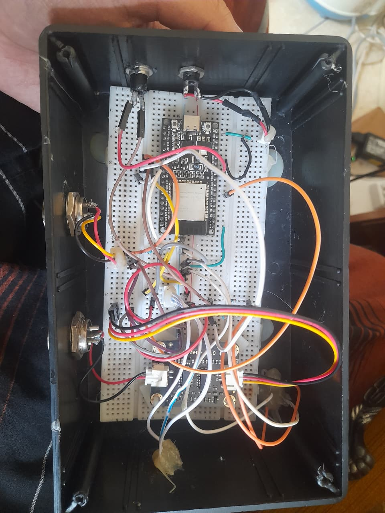    | **Konfigurasi Internal Proyek (Wiring)** Menampilkan tata letak ESP32, kabel, dan koneksi internal di dalam box project.                        |
|           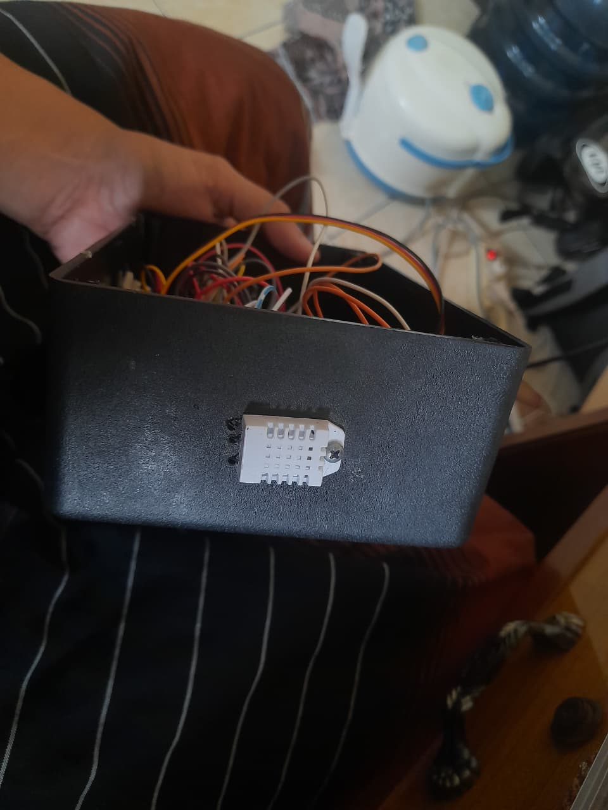           | **Sensor Suhu & Kelembapan (DHT22)** Modul sensor DHT22 yang digunakan untuk memantau kondisi lingkungan udara.                                 |
| 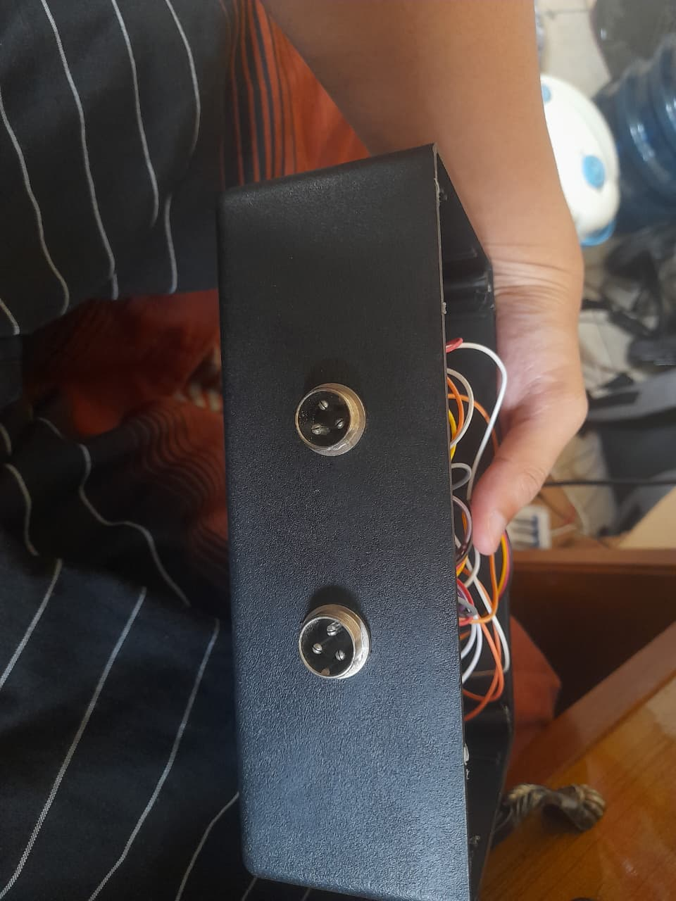 | **Konektor Sensor (Bagian Bawah)** Tampilan konektor aviation plug di bagian bawah untuk menghubungkan sensor eksternal.                        |
| 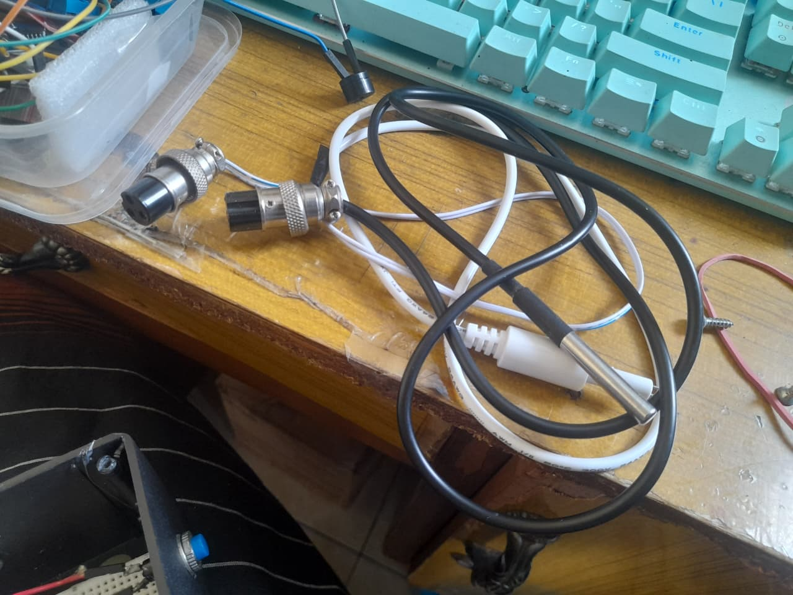  | **Sensor TDS & Suhu Air (DS18B20)** Sensor TDS (Warna Putih) untuk mengukur PPM dan sensor suhu air DS18B20 (Warna Hitam) dengan kabel panjang. |
|     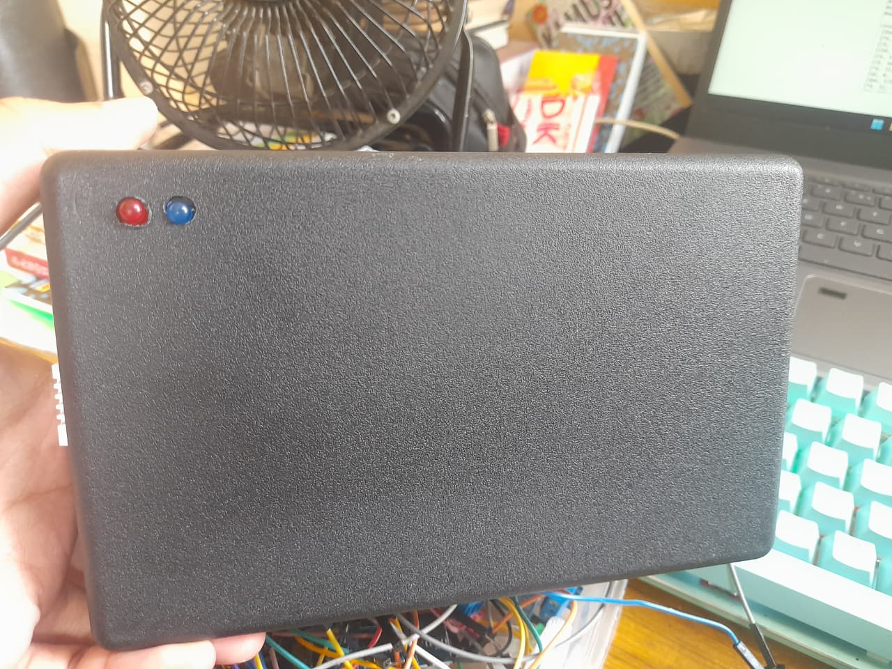      | **Tampilan Depan Box Project Proyek** Tampilan bagian depan box project dengan LED indikator status.                                            |
|    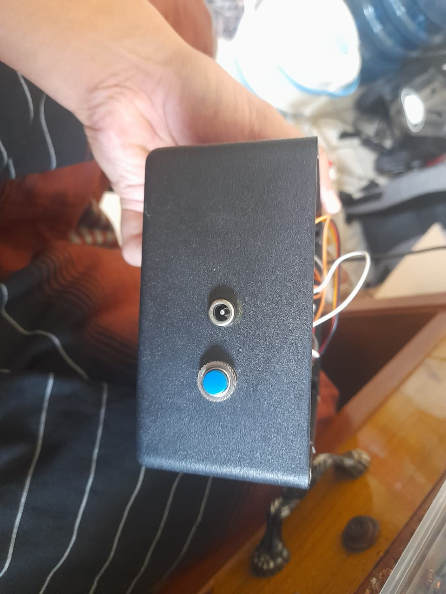    | **Sisi Samping (Jack DC & Tombol)** Tampilan samping box project yang menunjukkan jack input daya DC dan tombol reset.                          |

## 💻 Preview Tampilan Web

Berikut adalah preview dari Halaman Website TechBridge Hydroponic:

|                       Gambar                       | Deskripsi                                                                                                                                |
| :------------------------------------------------: | :--------------------------------------------------------------------------------------------------------------------------------------- |
|     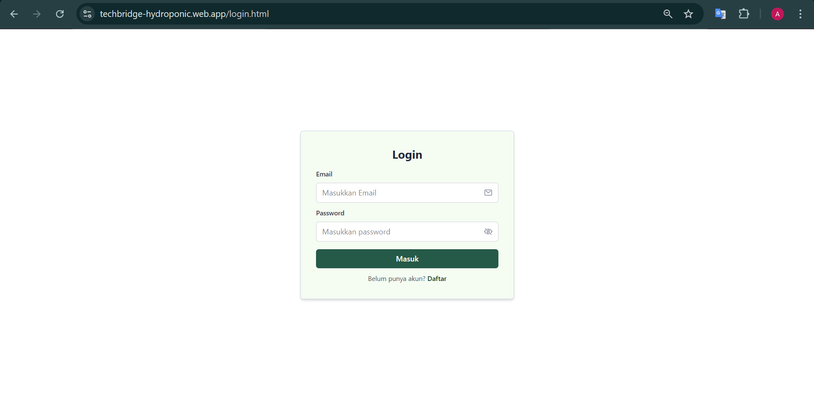     | **Halaman Login** Halaman autentikasi untuk mengakses dashboard monitoring TechBridge.                                                |
|  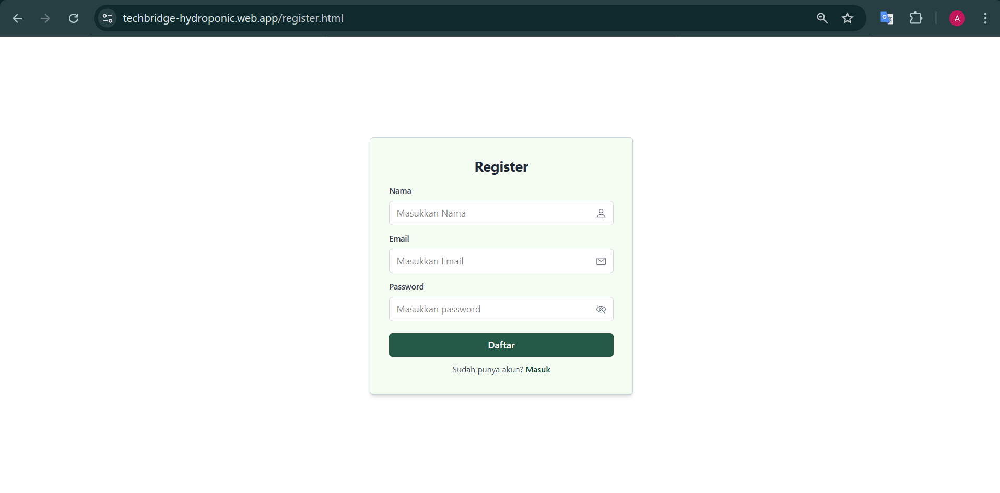  | **Halaman Register** Formulir untuk mendaftarkan akun pengguna baru.                                                                  |
|  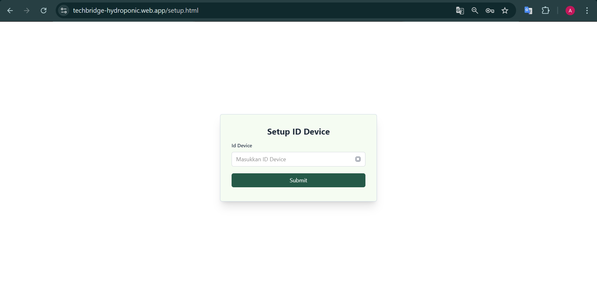   | **Halaman Konfigurasi Awal (Setup)** Halaman untuk menghubungkan website dengan perangkat ESP32 menggunakan ID Device.                |
| 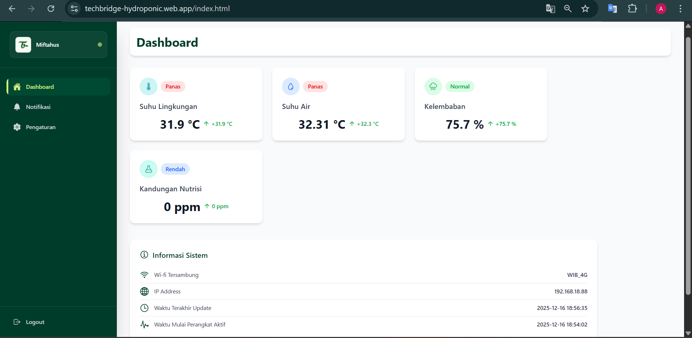 | **Halaman Dashboard Monitoring Utama** Menampilkan parameter sensor _real-time_ (TDS, suhu air, suhulingkungan dan kelembapan udara). |
| 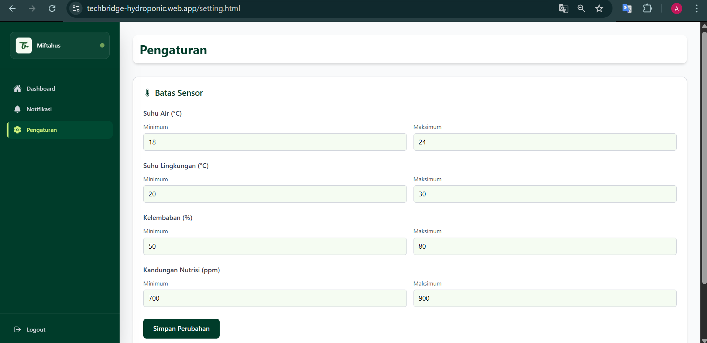  | **Halaman Pengaturan Threshold** Antarmuka untuk mengonfigurasi batas minimal dan maksimal dari setiap sensor.                        |
|  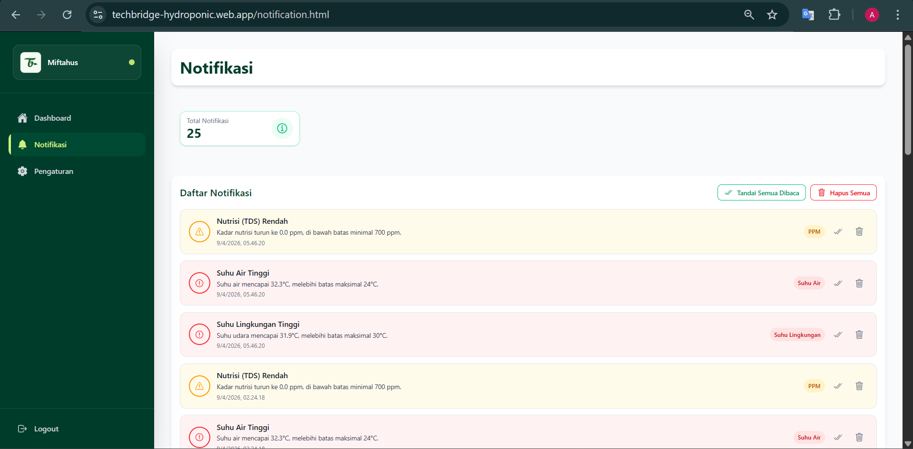   | **Halaman Notifikasi** Log historis dari peringatan yang dipicu saat sensor melebihi batas (sekarang dalam pengembangan).             |

